# NAPZA EDU CARD

Website kuis interaktif yang dikembangkan sebagai media penelitian untuk skripsi. Proyek ini bertujuan untuk memberikan edukasi mengenai NAPZA (Narkotika, Psikotropika, dan Zat Adiktif lainnya) melalui platform yang menarik dan modern.

## 🌟 Tentang Proyek

Ide pembuatan media ini diprakarsai oleh **Muhammad Rafi Amrullah**, seorang mahasiswa Bimbingan dan Konseling di Universitas Negeri Surabaya (angkatan 2022). Website ini kemudian dirancang dan dikembangkan oleh **Rahul Ubaidillah**, mahasiswa Pendidikan Teknologi Informasi di universitas yang sama (angkatan 2023).

Aplikasi ini dirancang untuk menguji pengetahuan pengguna tentang bahaya NAPZA melalui mode permainan yang berbeda, serta menyediakan materi edukatif yang mudah diakses.

## ✨ Fitur Utama

- **Mode Solo Survival**: Pemain dapat menguji pengetahuan mereka secara individu melalui serangkaian level dengan tingkat kesulitan yang berbeda.
- **Mode Multiplayer (Sharpen The Brain)**: Memungkinkan guru (Author) untuk membuat ruang kuis dan siswa (Player) untuk bersaing secara real-time.
- **Sistem Progres**: Pengguna yang terdaftar dapat melacak skor dan level terakhir yang diselesaikan.
- **Panel Admin**: Antarmuka khusus untuk admin mengelola (menambah, mengedit, menghapus) bank soal.
- **Dukungan Multibahasa**: Tersedia dalam Bahasa Indonesia dan Inggris.
- **Materi & Panduan**: Modal interaktif yang berisi materi edukatif dan panduan penggunaan aplikasi.

## 📸 Tampilan Aplikasi

Berikut adalah beberapa tangkapan layar yang menjelaskan alur penggunaan aplikasi.

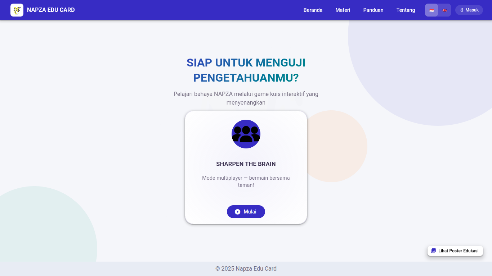
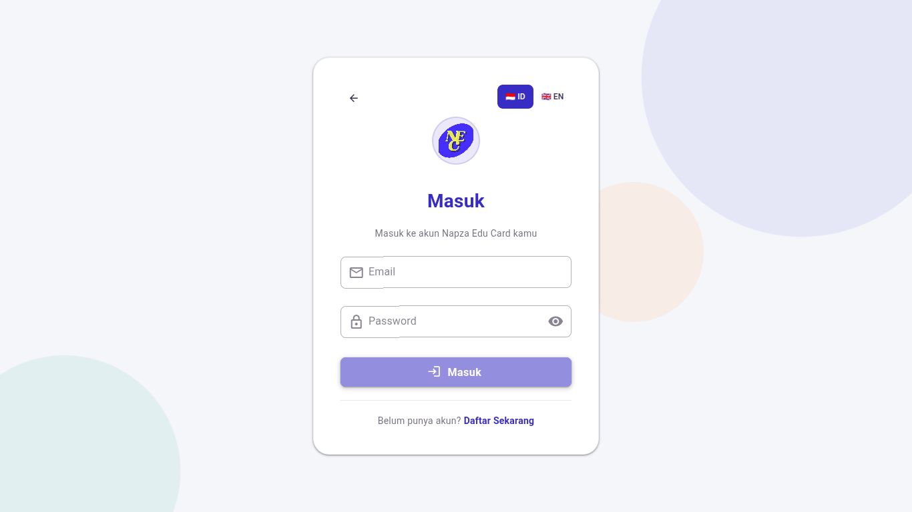
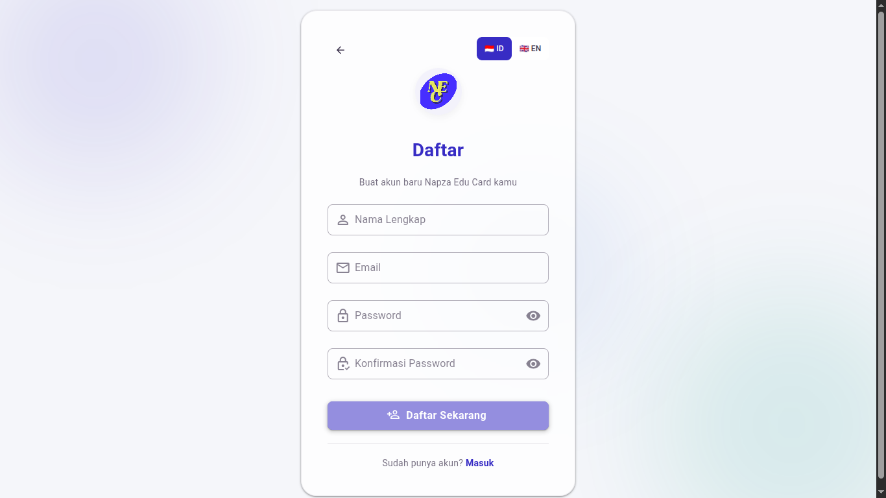
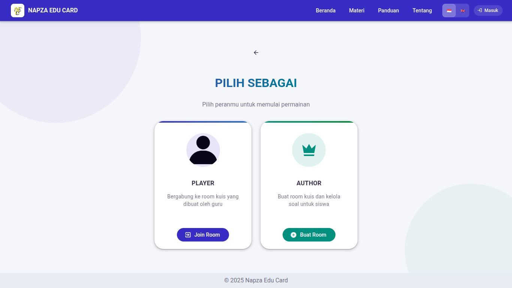
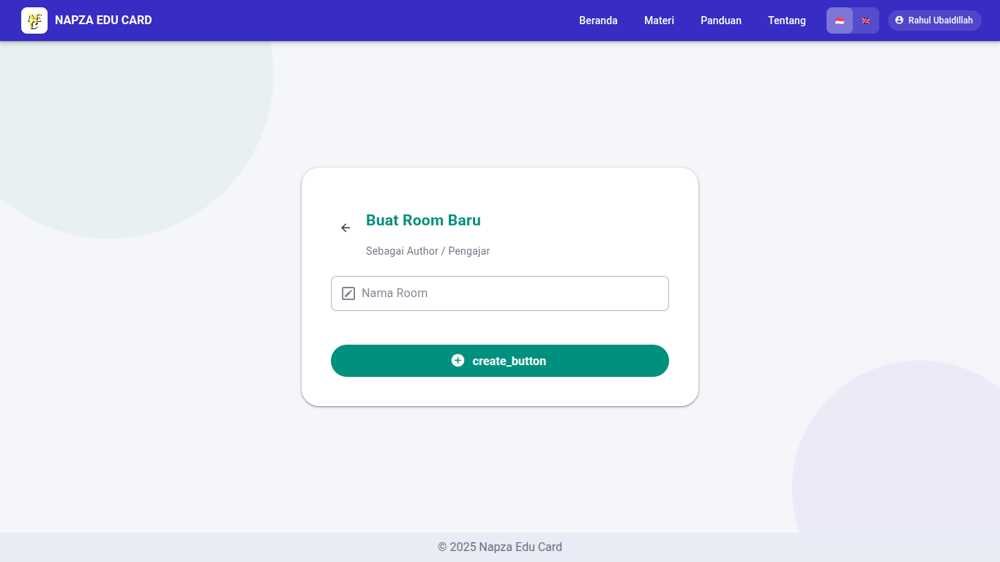
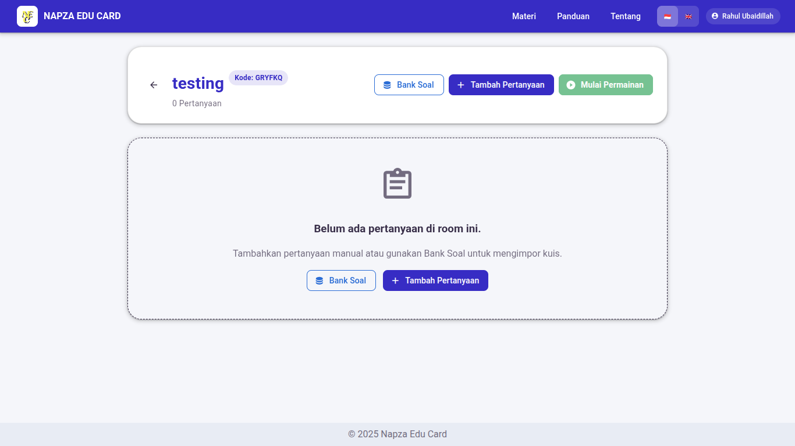
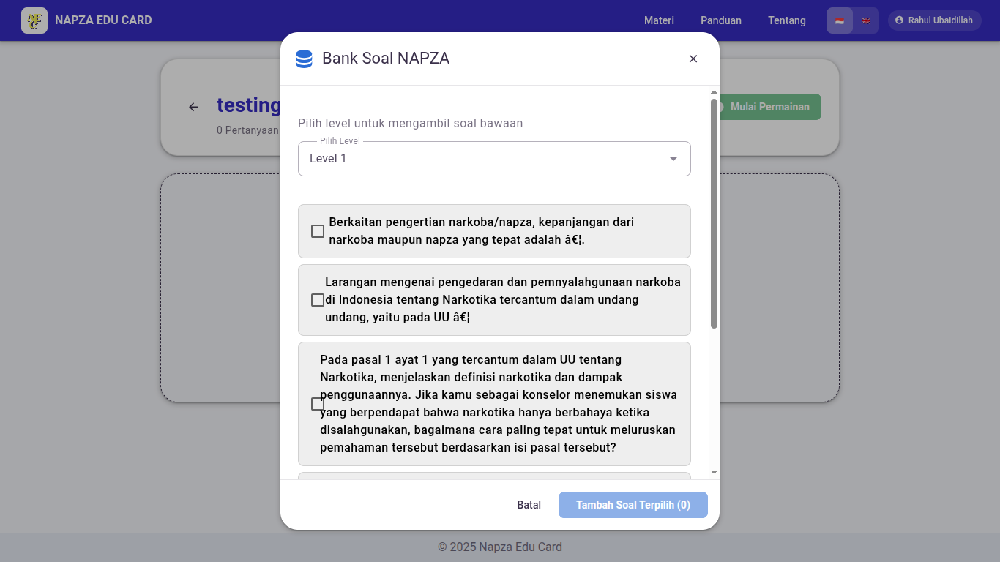
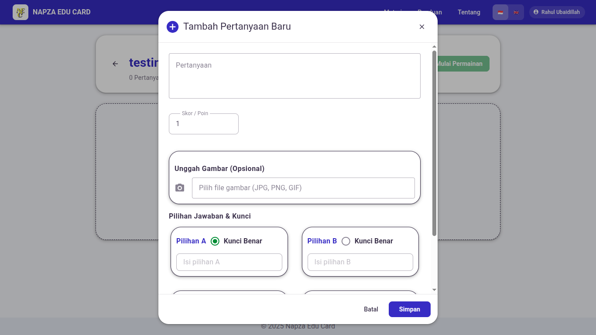
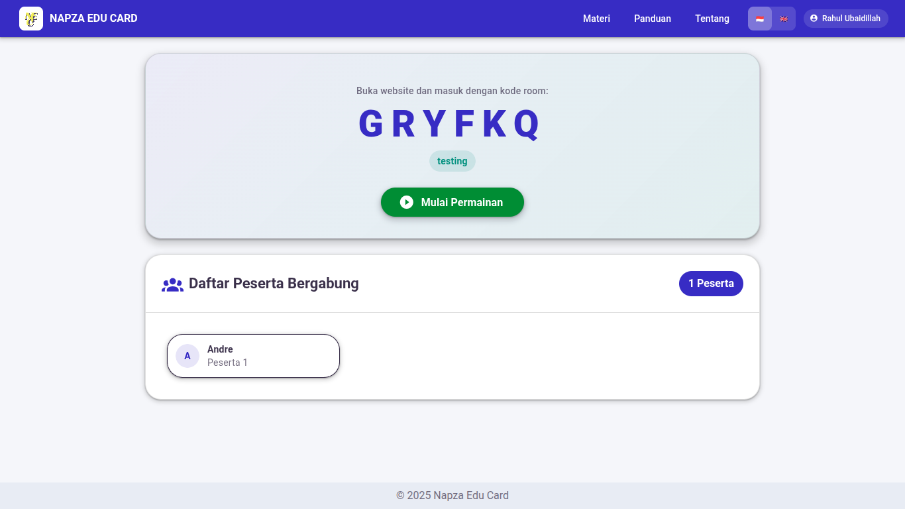
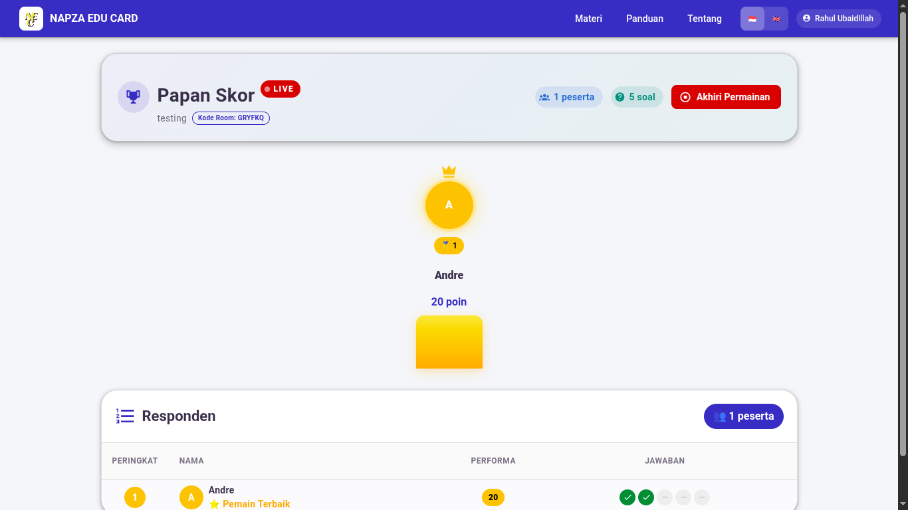
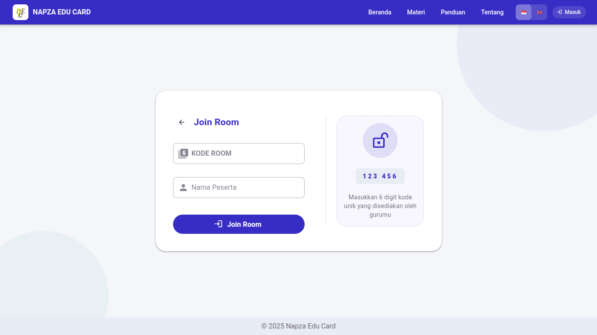
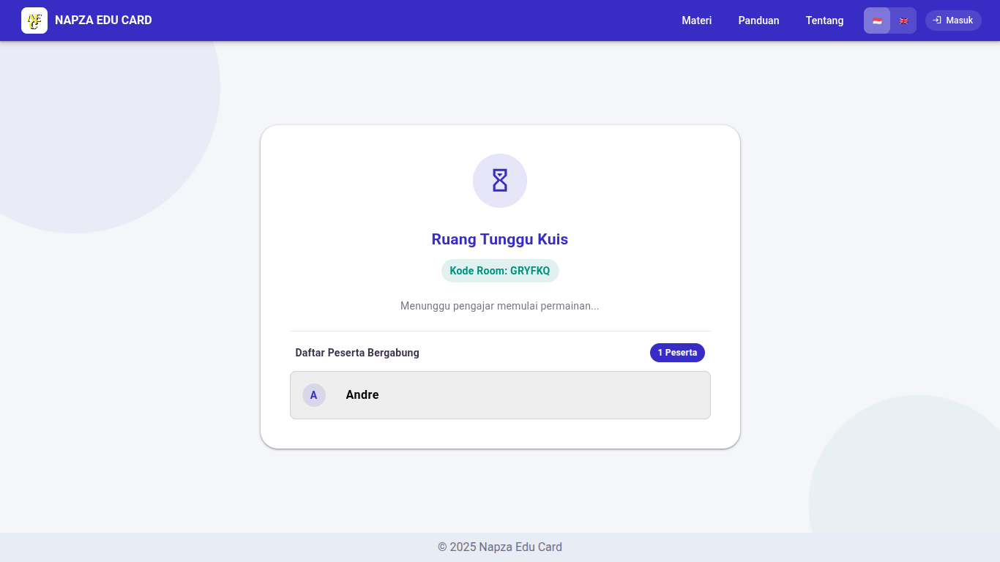
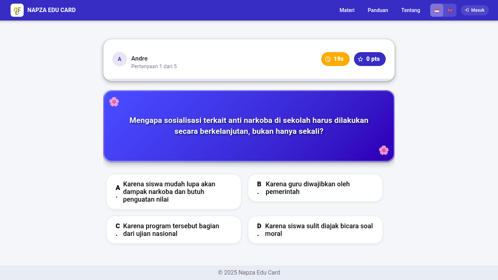
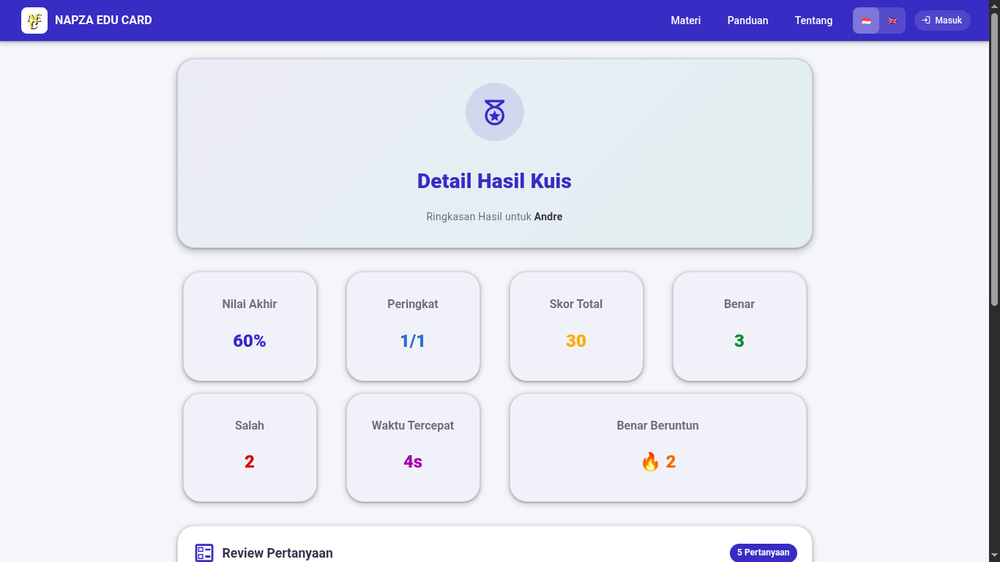
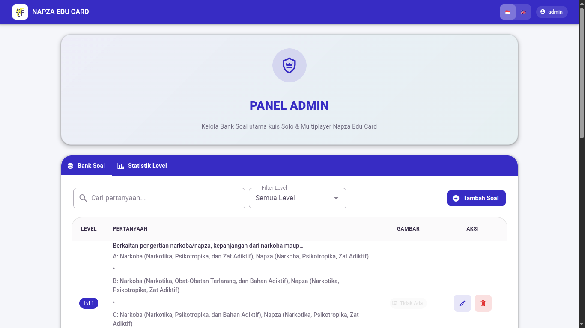
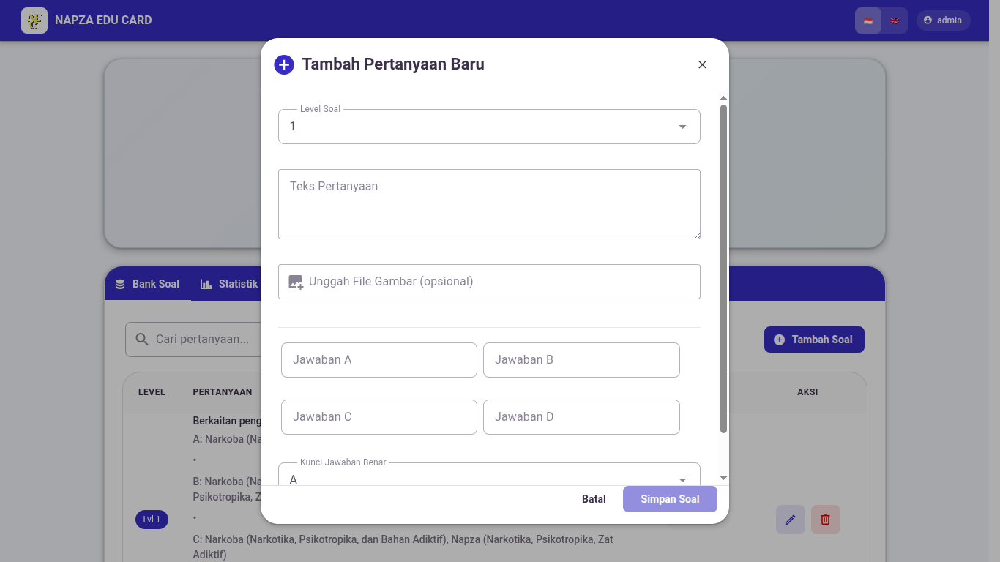
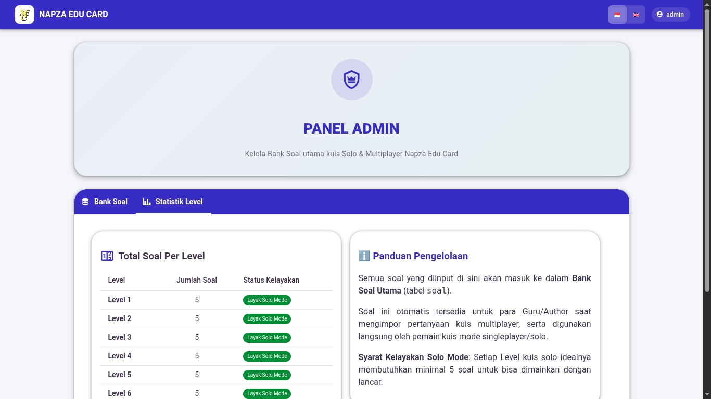

## 👥 Kontributor

- **Penggagas**: Muhammad Rafi Amrullah ([@rafiamrullah.\_](https://instagram.com/rafiamrullah._))
- **Developer**: Rahul Ubaidillah

## 🙏 Ucapan Terima Kasih

Terima kasih kepada semua pengguna yang telah mendukung dengan menggunakan dan menyebarkan game edukasi berbasis website ini. Kami menyadari bahwa aplikasi ini masih jauh dari sempurna. Oleh karena itu, kritik, saran, dan kontribusi dari komunitas sangat kami harapkan untuk pengembangan versi yang lebih baik di masa depan.
